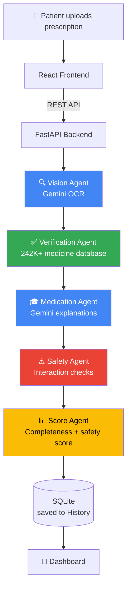

<div align="center">

# 🩺 CuraLens AI
### AI-Powered Prescription Intelligence

**Turning illegible handwriting into safe, understandable medication guidance.**

Built for the **Google AI Agent Builder Series 2026** (HiDevs) · Rural Health Track

[](https://ai.google.dev/)
[](https://fastapi.tiangolo.com/)
[](https://react.dev/)
[](https://www.python.org/)

🔗 **[Live Demo](https://cura-lens-ai.vercel.app)** · [Features](#-features) · [Architecture](#-architecture) · [Installation](#-installation) · [API](#-api-overview) · [Future Scope](#-future-scope)

</div>

---

## 💡 The Problem

Handwritten prescriptions are frequently illegible, leading to medication errors, missed drug interactions, and patients who don't understand what they're taking or why — a significant contributor to preventable harm, especially where pharmacist availability and health literacy are both limited.

**CuraLens AI is a second set of eyes.** It reads the prescription, cross-checks it against verified medicine data, flags safety concerns, and explains every medicine in plain language — without ever inventing a medical fact it isn't sure of.

---

## ✨ Features

| | |
|---|---|
| 🔍 **OCR Analysis** | Reads handwritten and printed prescriptions via Gemini 2.5 Flash, interpreting standard abbreviations (OD, BD, TDS, 1-0-1 dosage patterns, etc.) |
| ✅ **Medicine Verification** | Cross-checks every extracted medicine against **242,000+ real Indian medicines**, with an openFDA fallback |
| ⚠️ **Drug Interaction Detection** | Flags known interactions using curated, clinically-sourced interaction data |
| 🎓 **AI Medicine Education** | Explains purpose, dosage guidance, food instructions, warnings, and side effects in plain language |
| 📊 **Prescription Scoring** | A 0–100 completeness/safety score with a clear, honest breakdown of what's missing |
| 🔐 **Secure Authentication** | JWT-based sessions with bcrypt password hashing and login rate limiting |
| 📁 **Prescription History** | Every analysis is saved and reviewable later, scoped to the logged-in user |
| 📄 **PDF Export** | Download a shareable report of any analysis |

---

## 🏗️ Architecture



Each agent has a single, well-defined responsibility. An agent that can't find a definitive answer says so explicitly rather than guessing — a deliberate design constraint:

> **Prescription logic must be clinically certain, not probabilistic, wherever possible.**

---

## 🛠️ Tech Stack

<div align="center">

| Layer | Technology |
|:---:|:---:|
| **Frontend** | React (Vite) + Tailwind CSS |
| **Backend** | FastAPI (Python) |
| **AI** | Google Gemini 2.5 Flash (OCR + explanations) |
| **Database** | SQLite (SQLAlchemy) |
| **Auth** | JWT (signed tokens) + bcrypt + rate limiting |
| **Medicine Data** | 242,000+ curated + public Indian medicine dataset |
| **PDF Export** | jsPDF |
| **Hosting** | Render (backend) + Vercel (frontend) |

</div>

---

## 🚀 Installation

### Prerequisites
- Python 3.11+
- Node.js 18+
- A free Gemini API key from [Google AI Studio](https://aistudio.google.com/apikey)

### Backend

```bash
cd backend
python -m venv venv
venv\Scripts\activate        # Windows
# source venv/bin/activate   # macOS/Linux

pip install -r requirements.txt
```

Create a `.env` file in `backend/`:

```env
GEMINI_API_KEY=your-gemini-api-key
JWT_SECRET_KEY=your-random-secret-string
EMAIL_ADDRESS=your-email@example.com
EMAIL_PASSWORD=your-email-app-password
```

Run it:

```bash
python -m uvicorn app.main:app --reload
```

### Frontend

```bash
cd frontend
npm install
npm run dev
```

Visit **`http://localhost:5173`** 🎉

---

## 📡 API Overview

| Endpoint | Method | Description |
|---|:---:|---|
| `/ai/test` | `POST` | Upload a prescription image, run the full analysis pipeline |
| `/ai/report` | `POST` | Generate a PDF report from an analysis result |
| `/auth/register` | `POST` | Create a new account |
| `/auth/verify-otp` | `POST` | Verify email via OTP |
| `/auth/login` | `POST` | Log in, returns a signed JWT |
| `/history/me` | `GET` | List the logged-in user's saved prescriptions |
| `/history/detail/{id}` | `GET` | Fetch one saved prescription's full analysis |

---

## 🎯 Design Principle: Certainty Over Guessing

A core constraint of this project: information shown to a patient must be clinically grounded, never hallucinated.

- The OCR agent **never invents** a medicine name it can't visually support, and marks low-confidence reads as such
- Verification checks a **real database first** — only when a medicine truly isn't found does it fall back to a clearly-labeled **"AI Estimated"** explanation
- Drug interaction warnings come from **curated, sourced data** — not model inference
- When information genuinely isn't available, the app says **"Not Available"** — never a guess dressed up as fact

---

## ⚠️ Known Limitations

- **OCR accuracy** depends on handwriting legibility and photo quality, like any OCR system. Genuinely illegible handwriting may not be read correctly — the app is designed to fail *honestly* (low confidence, "not found") rather than guess.
- **AI-generated education content** (for medicines outside the curated database) is clearly labeled "AI Estimated" rather than "Database Verified" — always cross-check with a pharmacist for this category.
- **Free-tier hosting**: the backend may take 30-60 seconds to respond on first request after inactivity (cold start).

---

## 🔮 Future Scope

| Planned | Status |
|---|:---:|
| Reminder Agent (scheduled adherence tracking) | 🔲 Not started |
| Docker (one-command deployment) | 🔲 Not started |
| Automated test suite | 🔲 Not started |
| Firebase/Firestore migration | 🔲 Not started |
| Google ADK adoption | 🔲 Not started |
| Refresh tokens & further session hardening | 🔲 Not started |

---

## 👥 Contributors

<div align="center">

| | |
|:---:|:---:|
| **[@Rakshitha-cpu](https://github.com/Rakshitha-cpu)** | Creator & Developer |

</div>

---

## 📄 License

This project is licensed under the terms specified in the [LICENSE](./LICENSE) file.

---

<div align="center">

## 👩‍💻 Team

Built by **Rakshitha R** for the Google AI Agent Builder Series 2026 (HiDevs) — Rural Health Track

⭐ *If this project resonates with you, consider starring the repo!*

</div>
